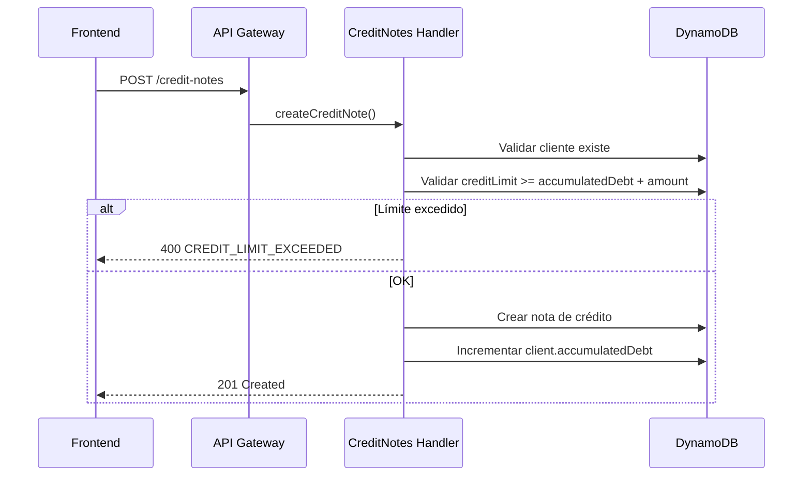
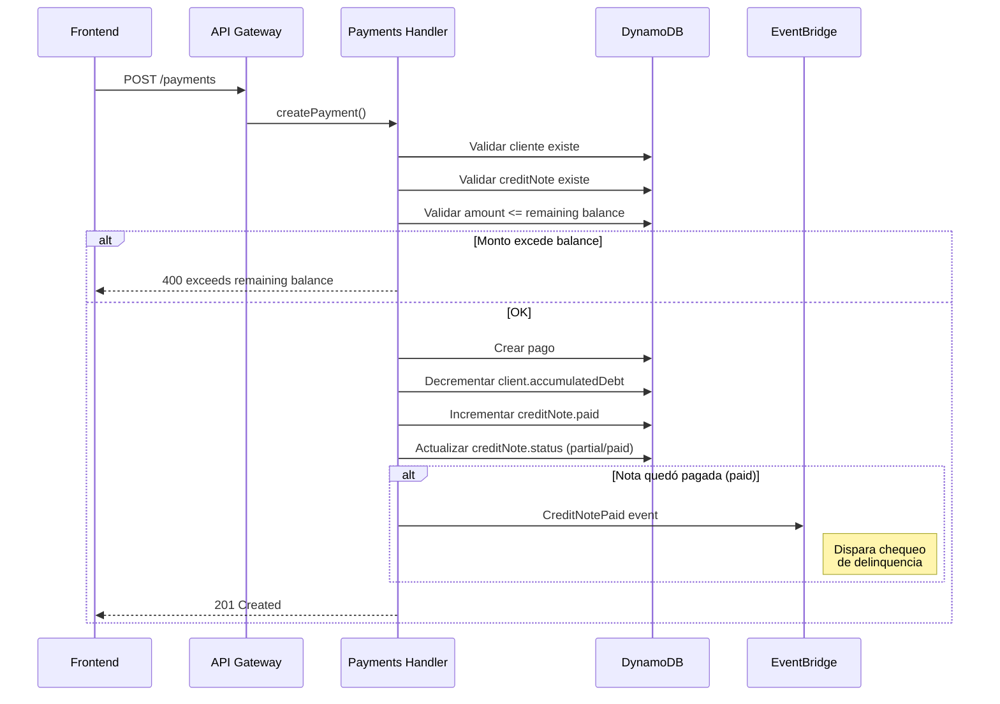
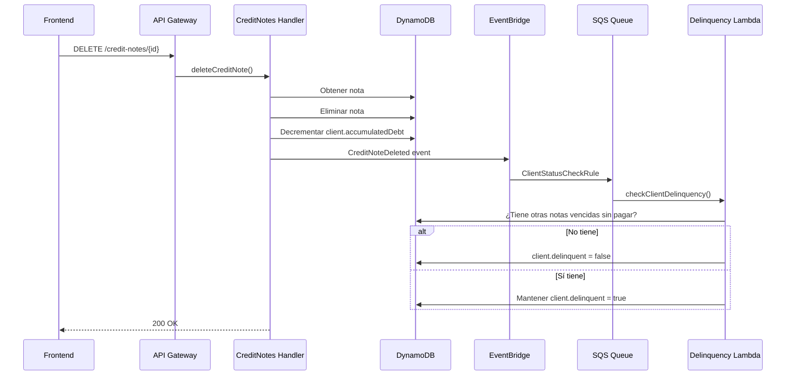
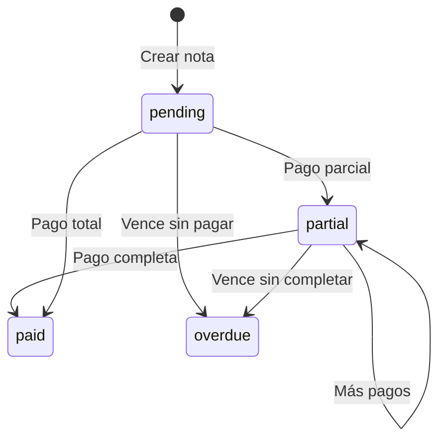
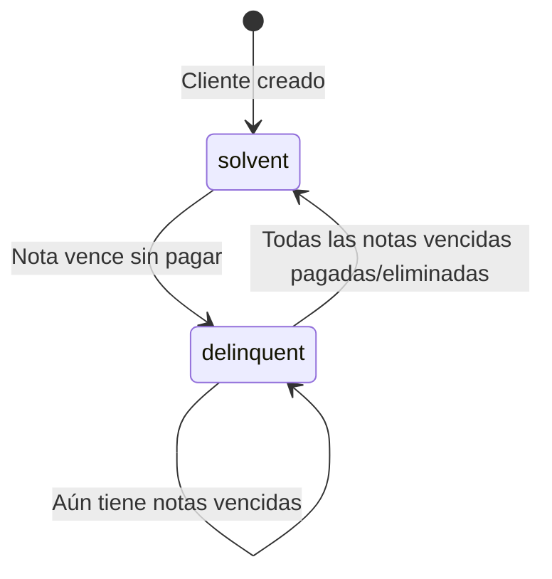
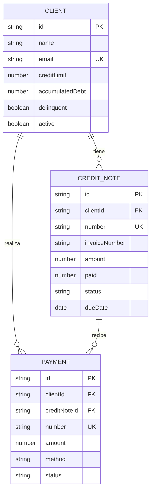

# Canaima Backend - API Quick Reference

> **Para detalles técnicos completos**, consulta [API_DOCUMENTATION.md](API_DOCUMENTATION.md)

---

## 📍 Base URL

```
https://{api-gateway-id}.execute-api.{region}.amazonaws.com/{stage}
```

Todos los endpoints están bajo `/orgs/{orgId}/...`

---

## 🔑 Entidades Principales

| Entidad | Descripción |
|---------|-------------|
| **Client** | Cliente B2B con límite de crédito |
| **CreditNote** | Nota de crédito/deuda del cliente |
| **Payment** | Pago recibido contra una nota de crédito |

---

## 📊 Endpoints Resumen

### Clients `/orgs/{orgId}/clients`

#### GET `/clients` - Listar clientes
**Query:** `?page=1&limit=20&search=&active=true&delinquent=false&sortBy=createdAt&sortOrder=asc`
```json
// Response 200
{
  "data": [{ "id": "", "name": "", "email": "", "creditLimit": 0, "accumulatedDebt": 0, "delinquent": false, "active": true }],
  "pagination": { "page": 1, "limit": 20, "totalPages": 1, "totalCount": 1 }
}
```

#### GET `/clients/{id}` - Obtener cliente
```json
// Response 200
{ "id": "", "name": "", "email": "", "phone": "", "address": "", "creditLimit": 0, "accumulatedDebt": 0, "delinquent": false, "active": true, "notes": "", "createdAt": "", "updatedAt": "" }
```

#### POST `/clients` - Crear cliente
```json
// Request
{ "name": "required", "email": "required", "phone": "", "address": "", "creditLimit": 0, "notes": "" }
// Response 201
{ "id": "", "name": "", "email": "", "creditLimit": 0, "accumulatedDebt": 0, "delinquent": false, "active": true, "createdAt": "", "updatedAt": "" }
```

#### PUT `/clients/{id}` - Actualizar cliente
```json
// Request (todos opcionales)
{ "name": "", "email": "", "phone": "", "address": "", "creditLimit": 0, "active": true, "delinquent": false, "notes": "" }
// Response 200: mismo formato que GET
```

#### DELETE `/clients/{id}` - Eliminar cliente
```json
// Response 200
{ "success": true, "message": "Client deleted" }
```

---

### Credit Notes `/orgs/{orgId}/credit-notes`

#### GET `/credit-notes` - Listar notas
**Query:** `?page=1&limit=20&search=&status=pending|partial|paid&clientId=&sortBy=createdAt&sortOrder=asc`
```json
// Response 200
{
  "data": [{ "id": "", "number": "NC-001", "clientId": "", "clientName": "", "invoiceNumber": "", "amount": 0, "paid": 0, "status": "pending", "dueDate": "", "description": "" }],
  "pagination": { "page": 1, "limit": 20, "totalPages": 1, "totalCount": 1 }
}
```

#### GET `/credit-notes/{id}` - Obtener nota
```json
// Response 200
{ "id": "", "number": "NC-001", "orgId": "", "clientId": "", "clientName": "", "invoiceNumber": "", "amount": 0, "paid": 0, "status": "pending", "dueDate": "", "description": "", "clientAccumulatedDebtAtRecord": 0, "clientCreditLimitAtRecord": 0, "createdAt": "", "updatedAt": "" }
```

#### POST `/credit-notes` - Crear nota
```json
// Request
{ "clientId": "required", "invoiceNumber": "required", "amount": "required > 0", "dueDate": "required ISO8601", "description": "", "status": "pending" }
// Response 201
{ "id": "", "number": "NC-001", "clientId": "", "clientName": "", "invoiceNumber": "", "amount": 0, "paid": 0, "status": "pending", "dueDate": "", "clientAccumulatedDebtAtRecord": 0, "createdAt": "", "updatedAt": "" }
// Error 400 - Límite excedido
{ "error": "Credit limit exceeded", "type": "CREDIT_LIMIT_EXCEEDED", "data": { "creditLimit": 50000, "exceedAmount": 2000 } }
```

#### PUT `/credit-notes/{id}` - Actualizar nota
```json
// Request (todos opcionales)
{ "number": "", "invoiceNumber": "", "amount": 0, "status": "pending|partial|paid", "dueDate": "", "description": "" }
// Response 200: mismo formato que GET
```

#### DELETE `/credit-notes/{id}` - Eliminar nota
```json
// Response 200
{ "success": true, "message": "Credit note deleted" }
```
> ⚡ **Side effect:** Recalcula `client.delinquent` automáticamente

---

### Payments `/orgs/{orgId}/payments`

#### GET `/payments` - Listar pagos
**Query:** `?page=1&limit=10&search=&status=confirmed|pending|rejected&method=cash|bank_transfer|mobile_payment|credit_card|other&clientId=&creditNoteId=&sortBy=createdAt&sortOrder=desc`
```json
// Response 200
{
  "data": [{ "id": "", "number": "AB-001", "creditNoteId": "", "clientId": "", "clientName": "", "invoiceNumber": "", "amount": 0, "method": "bank_transfer", "status": "pending", "bankName": "", "reference": "" }],
  "pagination": { "page": 1, "limit": 10, "totalPages": 1, "totalCount": 1 }
}
```

#### GET `/payments/{id}` - Obtener pago
```json
// Response 200
{ "id": "", "number": "AB-001", "orgId": "", "creditNoteId": "", "clientId": "", "clientName": "", "invoiceNumber": "", "amount": 0, "method": "bank_transfer", "status": "pending", "bankName": "", "reference": "", "description": "", "clientAccumulatedDebtAtRecord": 0, "clientCreditLimitAtRecord": 0, "createdAt": "", "updatedAt": "" }
```

#### POST `/payments` - Crear pago
```json
// Request
{ "creditNoteId": "required", "clientId": "required", "invoiceNumber": "required", "amount": "required > 0", "method": "required: cash|bank_transfer|mobile_payment|credit_card|other", "status": "pending", "bankName": "", "reference": "", "description": "" }
// Response 201
{ "id": "", "number": "AB-001", "creditNoteId": "", "clientId": "", "clientName": "", "invoiceNumber": "", "amount": 0, "method": "bank_transfer", "status": "pending", "clientAccumulatedDebtAtRecord": 0, "createdAt": "", "updatedAt": "" }
// Error 400 - Excede balance
{ "error": "Payment amount 2000 exceeds credit note remaining balance 1000" }
```
> ⚡ **Side effect:** Si la nota queda `paid`, dispara chequeo de delinquency

#### PUT `/payments/{id}` - Actualizar pago
```json
// Request (todos opcionales)
{ "number": "", "amount": 0, "method": "", "status": "", "bankName": "", "reference": "", "description": "" }
// Response 200: mismo formato que GET
```

#### DELETE `/payments/{id}` - Eliminar pago
```json
// Response 200
{ "success": true, "message": "Payment deleted" }
```

---

## 🔄 Flujos de Datos

### Flujo: Crear Nota de Crédito



**Campos afectados:**
- `client.accumulatedDebt` → **+amount**

---

### Flujo: Crear Pago



**Campos afectados:**
- `client.accumulatedDebt` → **-amount**
- `creditNote.paid` → **+amount**
- `creditNote.status` → `partial` o `paid`

---

### Flujo: Eliminar Nota de Crédito



**Campos afectados:**
- `client.accumulatedDebt` → **-amount** (de la nota eliminada)
- `client.delinquent` → **recalculado automáticamente**

---

##  Query Parameters Comunes

### Paginación

| Param | Default | Max | Descripción |
|-------|---------|-----|-------------|
| `page` | 1 | - | Número de página |
| `limit` | 20 | 500 | Registros por página |
| `sortBy` | createdAt | - | Campo para ordenar |
| `sortOrder` | asc | - | `asc` o `desc` |

### Filtros por Entidad

**Clients:**
- `search` - Busca en name, email
- `active` - `true` / `false`
- `delinquent` - `true` / `false`

**Credit Notes:**
- `search` - Busca en number, clientName, invoiceNumber
- `status` - `pending` / `partial` / `paid`
- `clientId` - Filtrar por cliente

**Payments:**
- `search` - Busca en number, clientName, invoiceNumber
- `status` - `confirmed` / `pending` / `rejected`
- `method` - `cash` / `bank_transfer` / `mobile_payment` / `credit_card` / `other`
- `clientId` - Filtrar por cliente
- `creditNoteId` - Filtrar por nota de crédito

---

## 🚨 Estados y Transiciones

### Credit Note Status



| Status | Condición |
|--------|-----------|
| `pending` | `paid = 0` |
| `partial` | `0 < paid < amount` |
| `paid` | `paid >= amount` |
| `overdue` | `dueDate < hoy` y no está `paid` |

### Client Delinquency



---

## ⚡ Eventos y Side Effects

| Acción | Evento Disparado | Efecto Automático |
|--------|------------------|-------------------|
| Crear CreditNote | `CreditNoteCreated` | +accumulatedDebt |
| Eliminar CreditNote | `CreditNoteDeleted` | -accumulatedDebt, recalcula delinquency |
| Crear Payment | `PaymentCreated` | -accumulatedDebt, actualiza nota |
| Payment completa nota | `CreditNotePaid` | Recalcula delinquency del cliente |
| Nota vence | (scheduler diario) | Marca cliente como delinquent |

---

## 🔗 Relaciones entre Entidades



---

## 📝 Notas Importantes

1. **Límite de Crédito**: No se puede crear una nota si `accumulatedDebt + amount > creditLimit`

2. **Pagos contra Notas**: Cada pago debe referenciar una `creditNoteId` válida

3. **Delinquency Automático**: El sistema actualiza `client.delinquent` automáticamente cuando:
   - Una nota vence → `true`
   - Se elimina una nota y no quedan más vencidas → `false`
   - Se paga completamente una nota vencida → `false`

4. **Números Automáticos**: Si no envías `number`, se genera automáticamente:
   - Notas: `NC-001`, `NC-002`, ...
   - Pagos: `AB-001`, `AB-002`, ...

5. **Timezone**: Todas las fechas en ISO 8601 UTC. El sistema usa `America/Caracas` internamente para cálculos de vencimiento.
