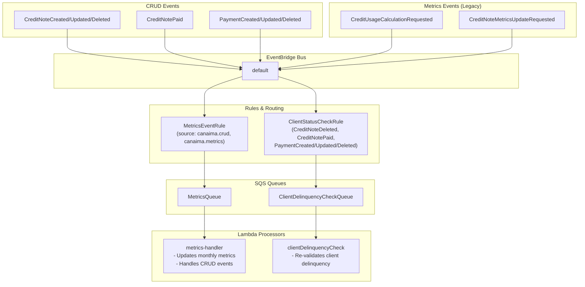

# EventBridge Events Documentation

Esta documento describe los eventos que se publican a EventBridge en el proyecto Canaima Backend, excluyendo los scheduled rules simples.

## Resumen de Eventos

El proyecto utiliza EventBridge para crear un sistema de eventos desacoplado que permite:
- Reacción a cambios de datos sin acoplamiento directo
- Procesamiento asincrónico de operaciones
- Enrutamiento inteligente a colas SQS y Lambda functions
- Escalabilidad: agregar nuevos processors sin modificar el flujo de eventos base

---

## Eventos CRUD (Nivel Base)

Estos son eventos **granulares y simples** que se disparan en cada operación CRUD. Permiten que múltiples procesos downstream reaccionen al mismo evento base.

### CreditNoteCreated

**Source:** `canaima.crud`  
**DetailType:** `CreditNoteCreated`  
**Disparo:** Cuando se crea un nuevo credit note  
**Destino:** SQS Queue → Lambda (metrics-handler)

```json
{
  "source": "canaima.crud",
  "detail-type": "CreditNoteCreated",
  "detail": {
    "type": "CreditNoteCreated",
    "orgId": "org_xxxxx",
    "entityId": "uuid-xxxxx",
    "data": { /* full credit note object */ },
    "timestamp": "2026-05-30T10:30:00.000Z"
  }
}
```

**Procesadores Actuales:**
- ✅ Actualiza métricas mensuales de credit notes

**Procesadores Futuros:**
- [ ] Auditoría/logging
- [ ] Webhooks a sistemas externos
- [ ] Análisis de patrones

---

### CreditNoteUpdated

**Source:** `canaima.crud`  
**DetailType:** `CreditNoteUpdated`  
**Disparo:** Cuando se actualiza un credit note  
**Destino:** SQS Queue → Lambda (metrics-handler)

```json
{
  "source": "canaima.crud",
  "detail-type": "CreditNoteUpdated",
  "detail": {
    "type": "CreditNoteUpdated",
    "orgId": "org_xxxxx",
    "entityId": "uuid-xxxxx",
    "data": { /* updated credit note object */ },
    "timestamp": "2026-05-30T10:30:00.000Z"
  }
}
```

**Procesadores Actuales:**
- ✅ Actualiza métricas mensuales de credit notes

---

### CreditNoteDeleted

**Source:** `canaima.crud`  
**DetailType:** `CreditNoteDeleted`  
**Disparo:** Cuando se elimina un credit note  
**Destino:** Dos caminos:
  1. SQS Queue → Lambda (metrics-handler) 
  2. SQS Queue → Lambda (client-delinquency-check) ← **NOTA: Este aún usa el evento legacy de canaima.credit-notes**

```json
{
  "source": "canaima.crud",
  "detail-type": "CreditNoteDeleted",
  "detail": {
    "type": "CreditNoteDeleted",
    "orgId": "org_xxxxx",
    "entityId": "uuid-xxxxx",
    "timestamp": "2026-05-30T10:30:00.000Z"
  }
}
```

**Procesadores Actuales:**
- ✅ Actualiza métricas mensuales de credit notes

---

### PaymentCreated

**Source:** `canaima.crud`  
**DetailType:** `PaymentCreated`  
**Disparo:** Cuando se crea un nuevo payment  
**Destino:** 
  1. SQS Queue → Lambda (metrics-handler)
  2. SQS Queue → Lambda (client-delinquency-check)

```json
{
  "source": "canaima.crud",
  "detail-type": "PaymentCreated",
  "detail": {
    "type": "PaymentCreated",
    "orgId": "org_xxxxx",
    "entityId": "uuid-xxxxx",
    "data": { /* full payment object */ },
    "timestamp": "2026-05-30T10:30:00.000Z"
  }
}
```

**Procesadores Actuales:**
- ✅ Actualiza métricas mensuales de payments
- ✅ Re-valida si el cliente sigue siendo delinquent

---

### PaymentUpdated

**Source:** `canaima.crud`  
**DetailType:** `PaymentUpdated`  
**Disparo:** Cuando se actualiza un payment  
**Destino:** 
  1. SQS Queue → Lambda (metrics-handler)
  2. SQS Queue → Lambda (client-delinquency-check)

```json
{
  "source": "canaima.crud",
  "detail-type": "PaymentUpdated",
  "detail": {
    "type": "PaymentUpdated",
    "orgId": "org_xxxxx",
    "entityId": "uuid-xxxxx",
    "data": { /* updated payment object */ },
    "timestamp": "2026-05-30T10:30:00.000Z"
  }
}
```

**Procesadores Actuales:**
- ✅ Actualiza métricas mensuales de payments
- ✅ Re-valida si el cliente sigue siendo delinquent

---

### PaymentDeleted

**Source:** `canaima.crud`  
**DetailType:** `PaymentDeleted`  
**Disparo:** Cuando se elimina un payment  
**Destino:** 
  1. SQS Queue → Lambda (metrics-handler)
  2. SQS Queue → Lambda (client-delinquency-check)

```json
{
  "source": "canaima.crud",
  "detail-type": "PaymentDeleted",
  "detail": {
    "type": "PaymentDeleted",
    "orgId": "org_xxxxx",
    "entityId": "uuid-xxxxx",
    "data": { "clientId": "xxx", "creditNoteId": "xxx", "amount": 1000 },
    "timestamp": "2026-05-30T10:30:00.000Z"
  }
}
```

**Procesadores Actuales:**
- ✅ Actualiza métricas mensuales de payments
- ✅ Re-valida si el cliente sigue siendo delinquent

---

## Eventos Agregados (Nivel Alto)

Estos eventos todavía existen pero fueron reemplazados conceptualmente por los eventos CRUD. Se mantienen para backward compatibility.

### CreditNoteDeletedEvent (Legacy)

**Source:** `canaima.credit-notes`  
**DetailType:** `CreditNoteDeletedEvent`  
**Destino:** SQS Queue → Lambda (client-delinquency-check)

Re-valida si un cliente sigue siendo delinquent después de eliminar un credit note.

---

### CreditUsageCalculationRequested

**Source:** `canaima.metrics`  
**DetailType:** `CreditUsageCalculationRequested`  
**Destino:** SQS Queue → Lambda (metrics-handler)

Se dispara explícitamente desde los handlers de payment (create/update/delete). Calcula porcentaje de uso de crédito.

---

### CreditNoteMetricsUpdateRequested (Legacy)

**Source:** `canaima.metrics`  
**DetailType:** `CreditNoteMetricsUpdateRequested`  
**Destino:** SQS Queue → Lambda (metrics-handler)

Legado, ahora reemplazado por eventos CRUD.

---

## Arquitectura: Comparación Antes vs Después

### ANTES (Acoplamiento a Funciones Específicas)

```
POST /payments
    ↓
  handler.ts (payments)
    ↓
  triggerCreditUsageCalculation()
    ↓
  publishMetricsEvent('CreditUsageCalculationRequested')
    ↓
  EventBridge
    ↓
  MetricsQueue (SQS)
    ↓
  metrics-handler Lambda
    ↓
  calculateCreditUsage() + saveCreditUsageRecord()
```

**Problema:** El handler de payments "sabe" que debe triggerar específicamente `CreditUsageCalculationRequested`. Es difícil agregar nuevos procesadores.

### DESPUÉS (Eventos CRUD Granulares)

```
POST /payments
    ↓
  handler.ts (payments)
    ↓
  publishCrudEvent('PaymentCreated')  ← Simple, genérico
    ↓
  EventBridge
    ↓
  MetricsRule (enruta a MetricsQueue)
    ↓
  metrics-handler Lambda
    ↓
  if (eventType === 'PaymentCreated') {
      // Processor 1: Calculate credit usage
      // Processor 2: (futuro) Update payment status
      // Processor 3: (futuro) Send notifications
      // ... escalable sin tocar el handler de payments
   }
```

**Ventajas:**
- ✅ Handlers solo disparan eventos CRUD simples
- ✅ Metrics-handler es responsable de orquestar qué se hace con cada evento
- ✅ Agregar nuevos procesadores es trivial: solo un nuevo `if (eventType === ...)` en metrics-handler
- ✅ Separación clara de responsabilidades

---

## Flujo de Enrutamiento de Eventos



---

## Cómo Agregar un Nuevo Métrica

**Ejemplo:** Agregar "Alerts cuando deuda > 80% del límite"

### Paso 1: El evento CRUD ya existe
```typescript
// En payments/handler.ts createPayment()
publishCrudEvent('PaymentCreated', orgId, payment.id, payment);
// Ya hecho, no cambiar
```

### Paso 2: Agregar procesador en metrics-handler
```typescript
// En metrics-handler.ts
if (eventType === 'PaymentCreated') {
    // Existente
    ...
    
    // NUEVO: Check if debt exceeds 80%
    const usage = await creditUsageRepo.calculateCreditUsage(orgId);
    if (usage.percentageUsed > 80) {
        await sendAlert(orgId, usage);  // Nueva función
    }
}
```

**Ventaja:** Sin tocar ningún handler API. Solo agregar lógica en el processor.

---

## Tabla de Responsabilidades

| Capa | Responsabilidad |
|------|-----------------|
| **API Handlers** | Cambios CRUD + `publishCrudEvent()` |
| **EventBridge** | Enrutamiento de eventos a colas |
| **Metrics Handler** | Orquestra qué procesadores ejecutar según tipo de evento |
| **Procesadores Específicos** | Lógica de negocio (updateMonthlyCreditNotesMetrics, etc.) |

---

## Próximas Mejoras

- [ ] Crear `CreditNoteDeletedEvent` basado en CRUD en lugar de evento separado
- [ ] Dead Letter Queue para eventos CRUD fallidos con reintentos
- [ ] Event versioning para backward compatibility (v1, v2, etc.)
- [ ] Analytics dashboard de eventos
- [ ] Webhooks para notificar cambios a sistemas externos
- [ ] Distributed tracing con AWS X-Ray
