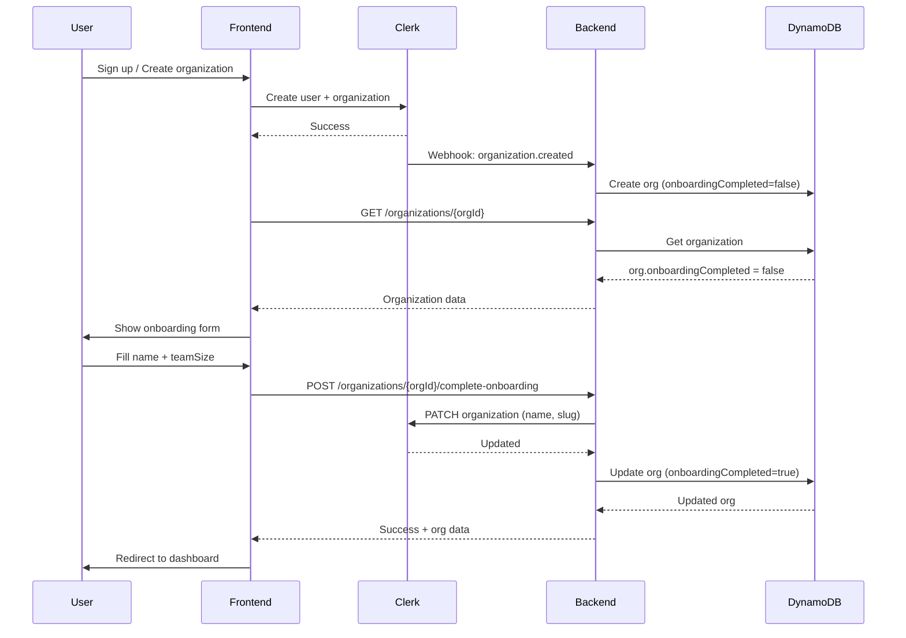

# Organization Onboarding Flow

## Overview

When a user signs up and creates an organization in Clerk, the system automatically creates a corresponding organization record in DynamoDB with `onboardingCompleted: false`. The user then completes an onboarding form in the frontend, which updates both Clerk and DynamoDB.

## Flow Diagram



## API Endpoints

### 1. Get Organization (Check Onboarding Status)

```http
GET /organizations/{orgId}
```

**Response:**
```json
{
  "data": {
    "clerkOrgId": "org_abc123",
    "name": "Unnamed Organization",
    "slug": "unnamed-organization",
    "plan": "free",
    "currency": "USD",
    "onboardingCompleted": false,
    "createdAt": "2024-01-15T10:30:00Z",
    "updatedAt": "2024-01-15T10:30:00Z"
  }
}
```

### 2. Complete Onboarding

```http
POST /organizations/{orgId}/complete-onboarding
Content-Type: application/json

{
  "name": "Acme Corporation",
  "teamSize": 10
}
```

**Response (Success):**
```json
{
  "data": {
    "clerkOrgId": "org_abc123",
    "name": "Acme Corporation",
    "slug": "acme-corporation",
    "teamSize": 10,
    "plan": "free",
    "currency": "USD",
    "onboardingCompleted": true,
    "onboardingCompletedAt": "2024-01-15T11:00:00Z",
    "createdAt": "2024-01-15T10:30:00Z",
    "updatedAt": "2024-01-15T11:00:00Z"
  },
  "message": "Onboarding completed successfully"
}
```

**Response (Already Completed):**
```json
{
  "data": { ... },
  "message": "Onboarding already completed"
}
```

## Frontend Implementation Guide

### 1. Check Onboarding Status After Login

```typescript
async function checkOnboardingStatus(orgId: string) {
  const response = await fetch(`${API_URL}/organizations/${orgId}`);
  const { data } = await response.json();
  
  if (!data.onboardingCompleted) {
    // Redirect to onboarding page
    router.push('/onboarding');
  } else {
    // Redirect to dashboard
    router.push('/dashboard');
  }
}
```

### 2. Submit Onboarding Form

```typescript
async function completeOnboarding(orgId: string, data: { name: string; teamSize: number }) {
  const response = await fetch(`${API_URL}/organizations/${orgId}/complete-onboarding`, {
    method: 'POST',
    headers: { 'Content-Type': 'application/json' },
    body: JSON.stringify(data),
  });
  
  if (response.ok) {
    router.push('/dashboard');
  }
}
```

## Webhook Events

The backend handles these Clerk webhook events:

| Event | Action |
|-------|--------|
| `organization.created` | Creates org in DynamoDB with `onboardingCompleted: false` |
| `organization.updated` | Ignored (we control updates via our API) |
| `organization.deleted` | Deletes org and all members from DynamoDB |

## Environment Variables

| Variable | Description | Required |
|----------|-------------|----------|
| `CLERK_WEBHOOK_SECRET` | Svix webhook signing secret | Yes |
| `CLERK_SECRET_KEY` | Clerk Backend API secret key | Yes (for Clerk sync) |

### Getting CLERK_SECRET_KEY

1. Go to [Clerk Dashboard](https://dashboard.clerk.com)
2. Select your application
3. Go to **API Keys** in the sidebar
4. Copy the **Secret key** (starts with `sk_`)

## Data Model

### Organization (DynamoDB)

| Field | Type | Description |
|-------|------|-------------|
| `PK` | String | `ORG#{clerkOrgId}` |
| `SK` | String | `META` |
| `clerkOrgId` | String | Clerk organization ID |
| `name` | String | Organization name |
| `slug` | String | URL-friendly name |
| `teamSize` | Number | Number of team members (from onboarding) |
| `plan` | String | `free` \| `starter` \| `pro` \| `enterprise` |
| `currency` | String | ISO 4217 code (default: `USD`) |
| `onboardingCompleted` | Boolean | Whether onboarding is complete |
| `onboardingCompletedAt` | String | ISO 8601 timestamp |
| `createdBy` | String | Clerk user ID of creator |
| `createdAt` | String | ISO 8601 timestamp |
| `updatedAt` | String | ISO 8601 timestamp |

## Error Handling

| Status | Description |
|--------|-------------|
| `400` | Missing orgId or validation error |
| `404` | Organization not found |
| `500` | Internal server error |

## Testing

### 1. Create Organization in Clerk

Use Clerk's dashboard or API to create a new organization. The webhook will automatically create a record in DynamoDB.

### 2. Verify Organization Created

```bash
curl https://your-api.execute-api.region.amazonaws.com/dev/organizations/{orgId}
```

Expected: `onboardingCompleted: false`

### 3. Complete Onboarding

```bash
curl -X POST https://your-api.execute-api.region.amazonaws.com/dev/organizations/{orgId}/complete-onboarding \
  -H "Content-Type: application/json" \
  -d '{"name": "My Company", "teamSize": 5}'
```

### 4. Verify Onboarding Complete

```bash
curl https://your-api.execute-api.region.amazonaws.com/dev/organizations/{orgId}
```

Expected: `onboardingCompleted: true`, `onboardingCompletedAt: "..."`
